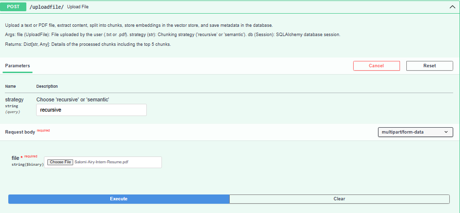
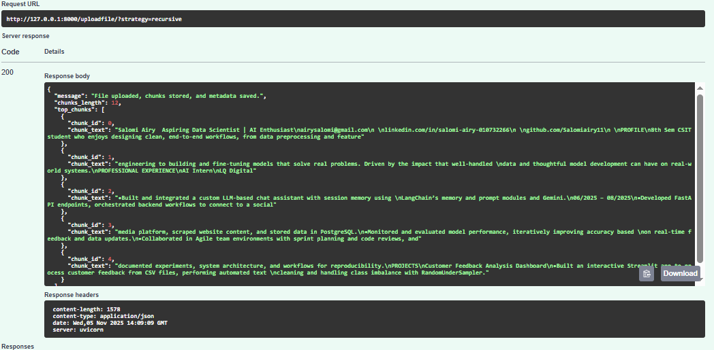
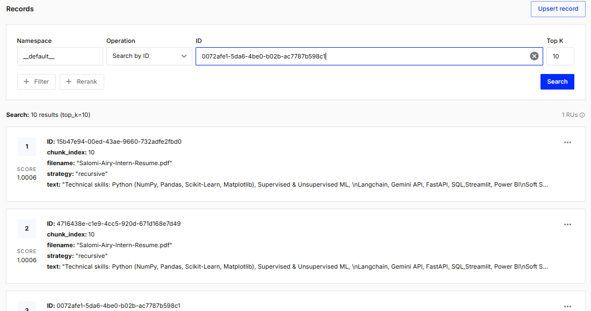
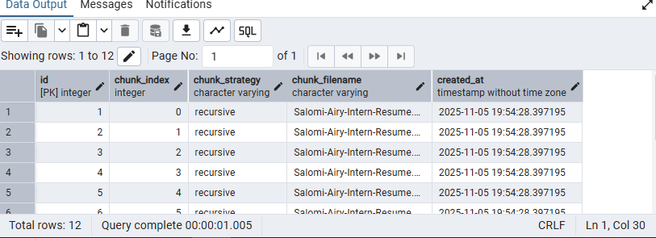
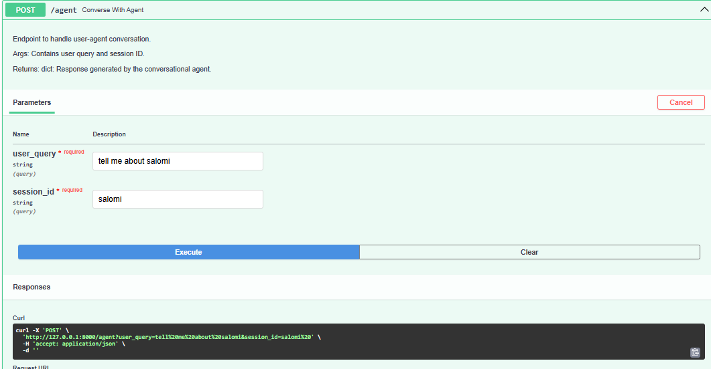
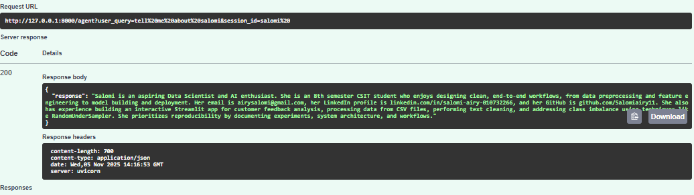
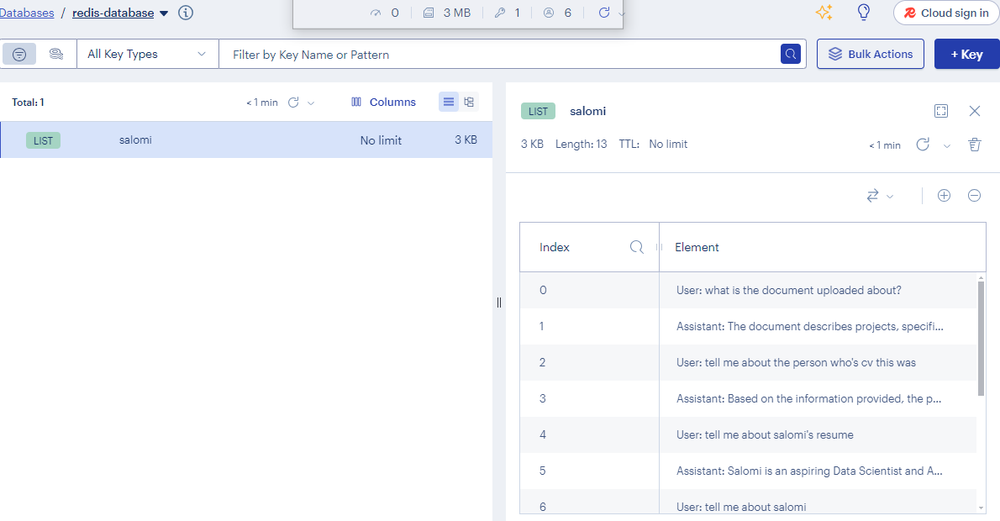
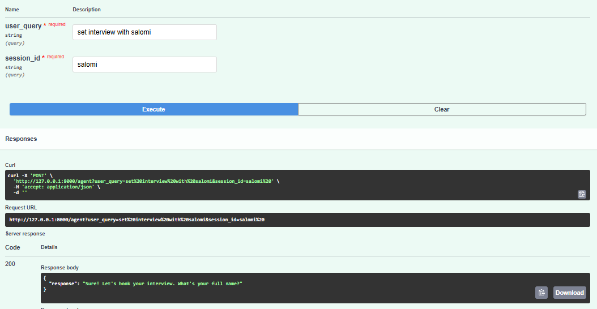
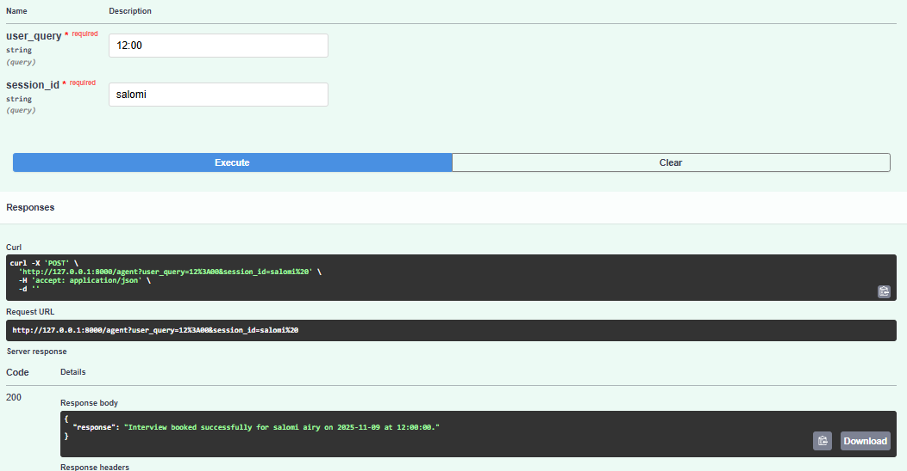
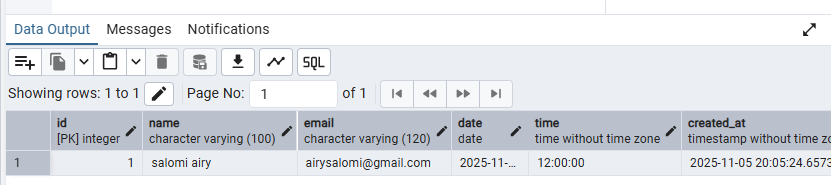

# Conversational RAG & Document Ingestion API

Two FastAPI endpoints:

- **Document Ingestion API** – Upload documents, generate embeddings, and store metadata.
- **Conversational RAG API** – Multi-turn retrieval-augmented conversation with chat memory and interview booking support.

---

## Features

### Document Ingestion API

- **Upload .pdf or .txt files**  
  

- **Extract text and apply any of the two chunking strategies:**

  - Recursive Character Chunking
  - LLM Semantic Chunking  
    

- **Generate embeddings and store in Pinecone vector database**

  

- **Save metadata in PostgreSQL**

  

### Conversational RAG API

- **Custom RAG pipeline (no RetrievalQAChain)**

  

  

- **Handles multi-turn queries with chat memory stored in Redis**

  

- **Supports interview booking (name, email, date, time)**

  

  

  

---

## Tech Stack

- **Backend:** FastAPI
- **Vector Database:** Pinecone
- **Chat Memory:** Redis
- **Database:** PostgreSQL
- **Python Libraries:** Pydantic, LangChain, PyPDF2, requests

---
